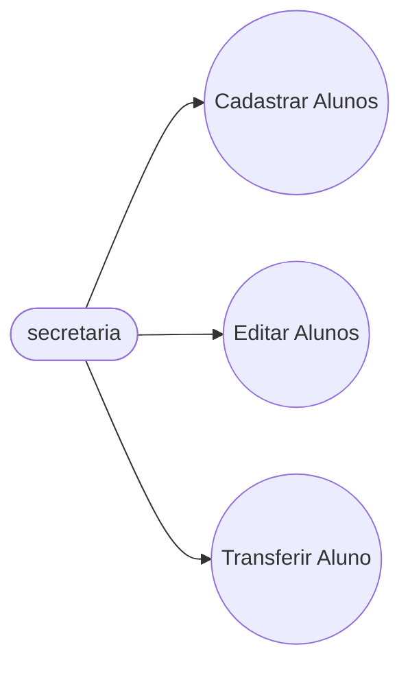
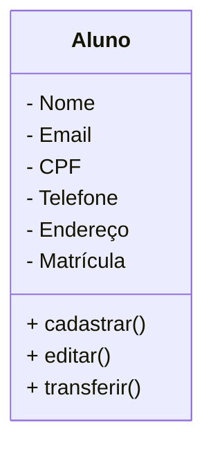

# Projeto Universidade

Modelagem em Orientação à Objetos das Entidadess Alunos, Cursos e Turmas.

## Caso de Uso 

## Diagrama de Classes

## Dependências
- **VsCode**: IDE (Interface de desenvolvimento)

- **Mermaid**: Linguagem para confecção de Diagramas em documentos MD (Mark Down)

- **Material Icon Theme**: Tema para Colorir as pastas.

- **Git Lens**: Interface gráfica para o versionamento .git integrada no VSCode.

# MySQL

- Banco de Dados: Programa hospedado na máquina, com objetivo de persistir os dados fisicamente no HD.

- Base de Dados: Conjunto de tabelas.

- Tabelas: Conjunto de registros.

- Registros: Uma linha na tabela, contendo a informação dos seus atributos.

- Atributos: Uma das caracteristicas da tabela (Colunas).

## Bibliotecas Python

Python 